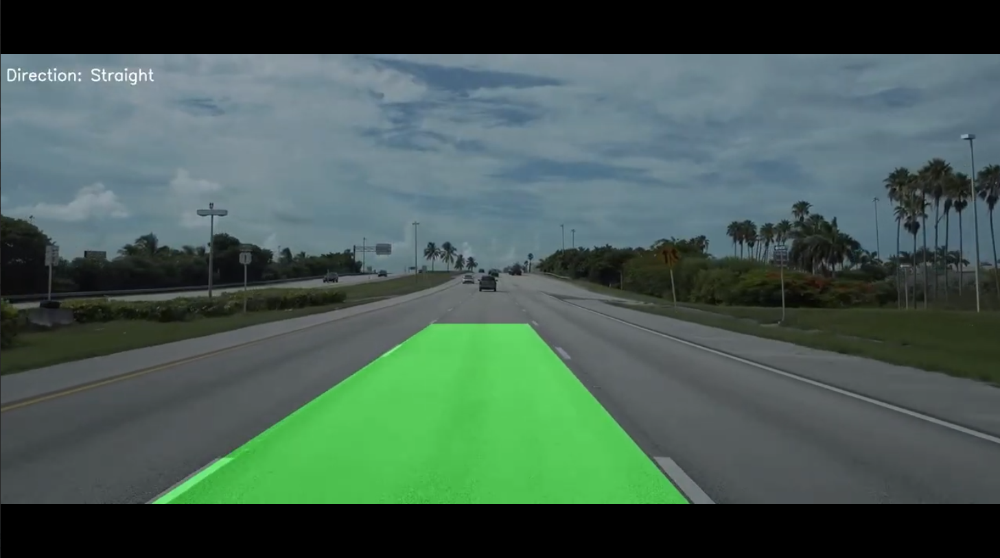
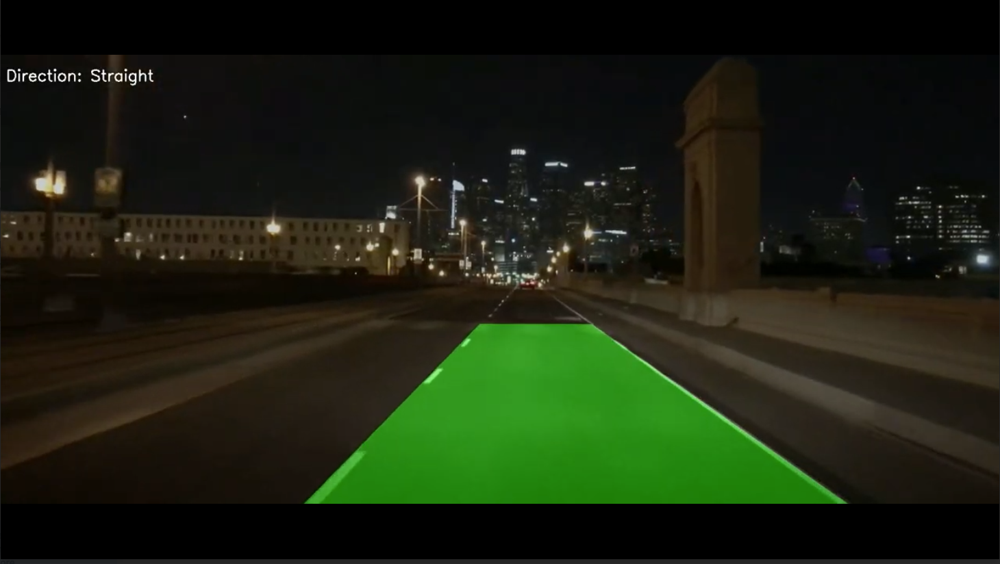
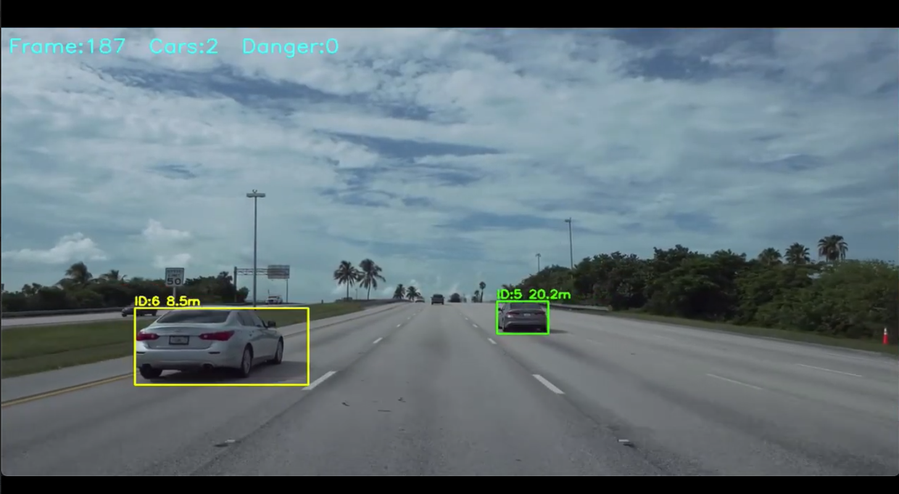
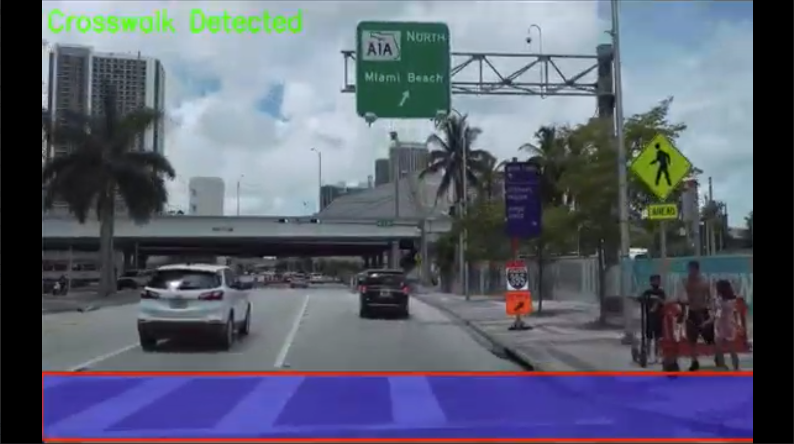

with open("README.md", "w") as f:
    f.write("""# 🚗 ADAS Computer Vision Pipeline: Lane, Vehicle & Crosswalk Detection

A modular, real-time Computer Vision pipeline built with Python and OpenCV. Designed as a prototype for Advanced Driver-Assistance Systems (ADAS), this project processes dashcam footage to extract critical traffic environment elements. It relies entirely on foundational computer vision and geometric processing techniques, providing high-speed analysis without the computational overhead of deep learning inference.

## 🎯 Project Goals

- **Robust Lane Tracking:** Detect and highlight lane boundaries under varying lighting conditions (day and night).
- **Vehicle Proximity Simulation:** Identify moving vehicles, track them across frames, and estimate their real-world distance to issue forward collision warnings.
- **Crosswalk Recognition:** Detect pedestrian zebra crossings using deterministic geometric pattern analysis.

---

## ⚙️ Core Modules & Methodology

### 1. Lane Detection (Day & Night)
The lane detection module utilizes a multi-step spatial pipeline designed to isolate lane markings regardless of environmental lighting.

**How it works:**
1. **Pre-processing:** Applies CLAHE (Contrast Limited Adaptive Histogram Equalization) to balance lighting, particularly useful for nighttime footage.
2. **Color Masking:** Converts the frame to the HSV color space to dynamically mask white and yellow hues.
3. **Edge & Line Extraction:** Extracts a Region of Interest (ROI) (typically the bottom 40-60% of the frame), applies Gaussian Blurring, and runs Canny Edge Detection.
4. **Hough Transform & Polynomial Fitting:** Uses `cv2.HoughLinesP` to find line segments. Segments are filtered by slope to discard horizontal noise. The remaining points are fitted to a mathematical polynomial (either linear or 2nd-degree, depending on the module).
5. **Temporal Smoothing:** A rolling `deque` buffer averages the polynomial coefficients over the last 10 frames to prevent jitter and stabilize the projected lane overlay.

**Visual Results:**


*Daytime conditions: Clear extraction of lane boundaries with stabilized overlay.*


*Nighttime conditions: Successful lane tracking despite high contrast and low visibility.*

---

### 2. Vehicle Detection & Proximity Estimation
This module identifies moving vehicles in the forward path and calculates their distance to simulate a collision warning system.

**How it works:**
1. **Background Subtraction:** Uses the MOG2 (Mixture of Gaussians) background subtractor to isolate moving foreground objects.
2. **Morphological Filtering:** Applies iterative closing and opening operations with an elliptical kernel (9x9) to merge fragmented vehicle parts into solid blobs.
3. **Shape Profiling:** Contours are heavily filtered based on physical vehicle constraints:
   - *Area:* Discarding noise (too small) and the ego-hood (too large).
   - *Aspect Ratio (0.5 to 4.0):* Ensuring the shape resembles a car's rear profile.
   - *Extent & Solidity:* Ensuring the bounding box is densely packed with foreground pixels.
4. **Centroid Tracking:** A custom object tracker calculates the centroid of each bounding box. It associates new detections to existing tracks if they fall within a specific pixel radius (80px), enforcing object permanence. Objects must be tracked for several consecutive frames to be "confirmed."
5. **Distance Estimation:** Utilizes a pinhole camera model. By assuming a fixed real-world vehicle height (1.5 meters) and a constant focal length, the system calculates distance dynamically: `Distance = (Focal Length * Real Height) / BoundingBox Height`.

**Visual Results:**


*Real-time vehicle ID assignment and distance estimation (Warning ranges are color-coded).*

---

### 3. Crosswalk Recognition
The crosswalk detector is designed to identify the high-frequency alternating contrast patterns of zebra crossings within the ego-vehicle's path.

**How it works:**
1. **Targeted ROI:** Isolates the bottom half of the frame where crosswalks will appear.
2. **White Masking:** Isolates bright white pixels in the HSV color space.
3. **Transition Analysis (1D Signal Processing):** Scans the ROI row by row, counting the number of transitions from black to white. A row is flagged as "stripy" if it exceeds a threshold of 15 transitions.
4. **Geometric Validation:** If 40 consecutive rows are marked as "stripy", a bounding box is generated.
5. **Column Validation:** The bounded region is further verified by scanning vertically (columns) to ensure the presence of distinct stripes, confirming the presence of a crosswalk rather than a solid white line or noise.

**Visual Results:**


*Detection of high-frequency white/black transitions identifying the crosswalk zone.*

---

## 📁 Project Structure

```text
lane-detection/
├── data/
│   ├── miamifirstbasic.avi               # Source dashcam video
│   └── miamifirstbasic2.avi              # Source dashcam video
├── figures/
│   ├── lane_day.jpg                      
│   ├── lane_night.jpg                    
│   ├── car_tracking.jpg                  
│   └── crosswalk_detection.jpg           
├── src/
│   ├── lane_detection.py                 # Core lane tracking script
│   ├── lane_line.py                      # Lane smoothing and temporal history
│   ├── linefitting.py                    # Curve and polynomial math
│   ├── crosswalk.py                      # Crosswalk detection logic
│   ├── car_detection.py                  # Vehicle tracking & distance math
│   ├── filters.py                        # Pre-processing (CLAHE, HSV)
│   ├── lanedet.py                        # Alternative lane algorithm
│   └── startofwork.py                    # Early ROI cropping scripts
├── README.md
└── requirements.txt

🚀 How to Run
Prerequisites

Ensure you have Python 3.x installed along with the required libraries.
Bash

pip install opencv-python numpy

Execution

Place your dashcam videos in the root or data/ directory. Run the modules independently to view specific ADAS features:

Run Vehicle Detection & Distance Tracking:
Bash

python src/car_detection.py

(Press p during runtime to print live contour and shape metrics to the console).

Run Crosswalk Recognition:
Bash

python src/crosswalk.py

(Press p to print row/column transition statistics).

Run Complete Lane Detection Pipeline:
Bash

python src/lane_detection.py

👨‍💻 Authors

    Ido S.

    Charlie. A.N

